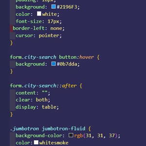

# 06-Server-Side-APIs-Weather-Dashboard
## Introduction:
In this repo our job was to create a simple calendar application that allows a user to save events for each hour of the day. We were given html and CSS starter code. Withe the expectation to build the JS code from scratch. The planner should is supposed to run in the browser featuring updated HTML and CSS powered by jQuery.A key feature to this repo was we also had to use the [Moment.js](https://momentjs.com/) library to set our dates and time.

We created a static website that you can view on this link:
 [05-Third-Party-APIs-Work-Day-Scheduler](https://killjoyangel.github.io/05-Third-Party-APIs-Work-Day-Scheduler/)

## Technologies used:
* HTML
* CSS
* Java Script
* Jquery

## Original HTML  Code
![screenshot] (assets/images/htmlthumb.jpg)

### Original CSS

### Created JS and Jquery

## What final product was supposed to look like

## Completion of Work-Day-Scheduler

