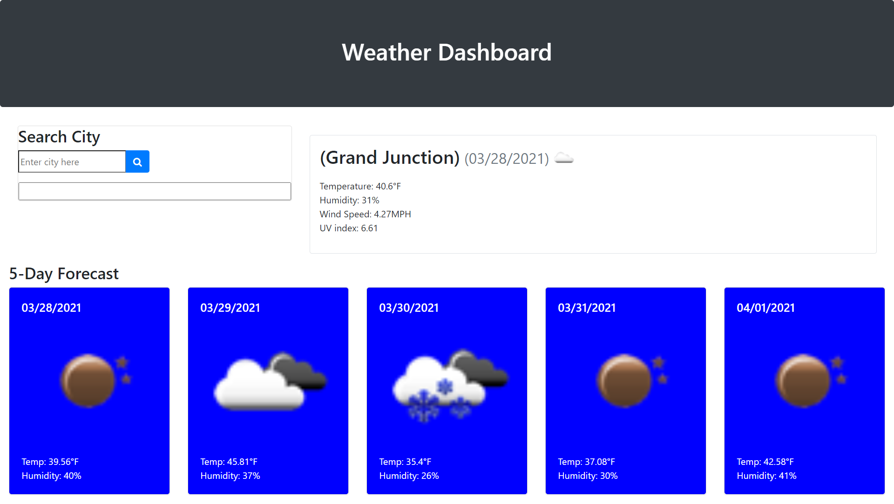

# 06-Server-Side-APIs-Weather-Dashboard
## Introduction:
In this repo our job was to create a weather dashboard. Where a traveler could  see the weather outlook for multiple cities as well as the current date's weather.

We created a static website that you can view on this link:
 [06-Server-Side-APIs-Weather-Dashboard](https://killjoyangel.github.io/06-Server-Side-APIs-Weather-Dashboard/)

## Technologies used:
* HTML
* CSS
* Java Script
* Jquery
* API calls

## Original HTML  Code

### Original CSS

### Created JS and Jquery

## What final product was supposed to look like

## Completion of weather dashboard

